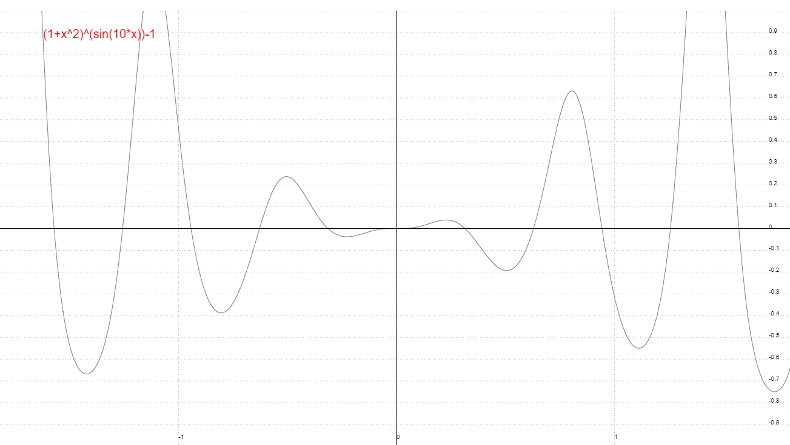
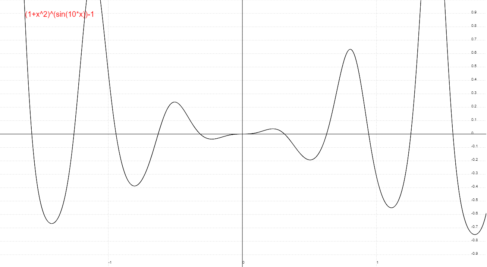
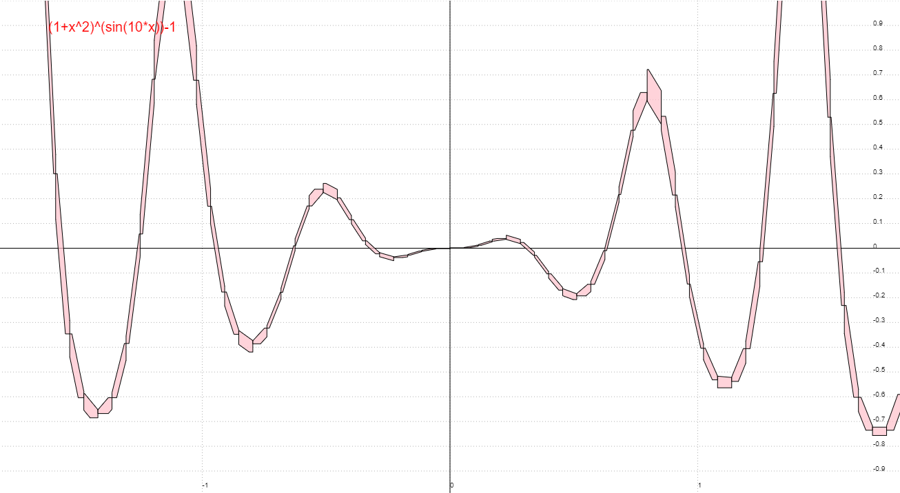

# Robust plots

Web app to plot robust enclosures of function graphs and parametric curves.

[Try it now!](https://michalkonecny.github.io/robust-plots/live)

## Examples

The above images are that of the graph `y=(1+x^2)^(sin(10*x))-1`. The left
images shows the rough version and the right shows the robust. The robust
version was obtained by drawing shapes that reliably enclose the exact objects.
In particular, rounding errors are correctly accounted for. These graphical
enclosures can be computed to an arbitrarily high accuracy. In the case of above
it was to a 10th of a pixel. In the images below the same objects are plotted
with a low accuracy so that the shapes are easy to see. In this case accurate to
40 pixels.

## Further documentation

- [Expression syntax](docs/syntax.md)
- [Developer instructions](docs/dev.md)
- [Benchmarking](docs/benchmark.md)
- Design overview diagrams:
  - [Internal state and component messages](https://drive.google.com/file/d/13J6XdY_bSFnk4_agCbaF5heJJpYJb5nI/view?usp=sharing)
  - [Data flow](https://drive.google.com/file/d/1jMKaTzwTjlZVNtuYDbEFOlKuLuhaBCNn/view?usp=sharing)
  - [UI states](https://drive.google.com/file/d/1TQAOJ9z4zPL4hxErC9RD7v0HPtfWOAvG/view?usp=sharing)
